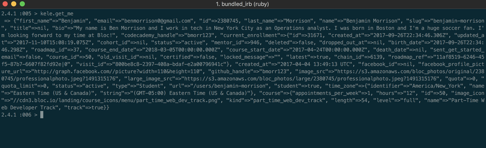

# Kele
## A ruby gem that interacts with the Bloc API

Kele is a basic Ruby gem that acts as an API client to interact with the [Bloc API endpoints](https://blocapi.docs.apiary.io/#). Although the API can be accessed via `cURL`, Kele provides easy-to-use methods that can interact with a handful of useful endpoints for students who are enrolled in [Bloc](https://www.bloc.io). You can use the Kele Client from your terminal, or include it in your own project.

### Prerequisites

This gem is built with `Ruby 2.4`. It also uses [`HTTParty 0.13`](https://github.com/jnunemaker/httparty) and [`json 1.8`](https://rubygems.org/gems/json/versions/1.8.3) gems as runtime dependencies

### Getting Started

If you would like to use this gem within another application, simply add `gem install kele` to your `Gemfile` to start using! Don't forget to run `bundle install` after editing your `Gemfile`.

This gem can also be ran in your terminal, within a ruby shell. To do so, follow these simple steps:

1. Clone this repository
2. `cd` into your new `kele` directory
3. You can use the standard Ruby shell by typing `irb` within your terminal
4. Once in the shell, execute `require ./lib/kele.rb` in order to use Kele's methods
5. Initialize a new instance of Kele by executing `kele = Kele.new(email, password)`, where `email` and `password` are your actual Bloc login credentials, passed as Strings
6. Once you finish step 5, you can call any of the available methods on your new `kele` variable!

### Available Methods

The following methods are available when using the Kele API client gem:

| **Method Name** | **Arguments** | **Description** |
| :---: | :---: | --- |
| `get_me` | _none_ | Retrieve the current user |
| `get_mentor_availability` | `mentor_id` | List mentor's available time slots for the current user |
| `get_roadmap` | `roadmap_id` | Show a roadmap and associated sections and checkpoints |
| `get_checkpoint` | `checkpoint_id` | Show a checkpoint with its associated body and assignment |
| `create_submission` | `checkpoint_id`, `assignment_branch`, `assignment_commit_link`, `comment` | Create a checkpoint assignment submission |
| `update_submission` | `submission_id`, `checkpoint_id`, `assignment_branch`, `assignment_commit_link`, `comment` | Update an existing checkpoint assignment submission |
| `get_messages` | `page` (optional integer) | Show message threads for current user, paginated. Will return a specific message thread page if `page` is passed |
| `create_message` | `recipient_id`, `token` (optional), `subject`, `message` | Create a new message on an existing conversation thread, or a new conversation thread with a message. Requests without a message thread `token` will create a new thread with the `message` |
